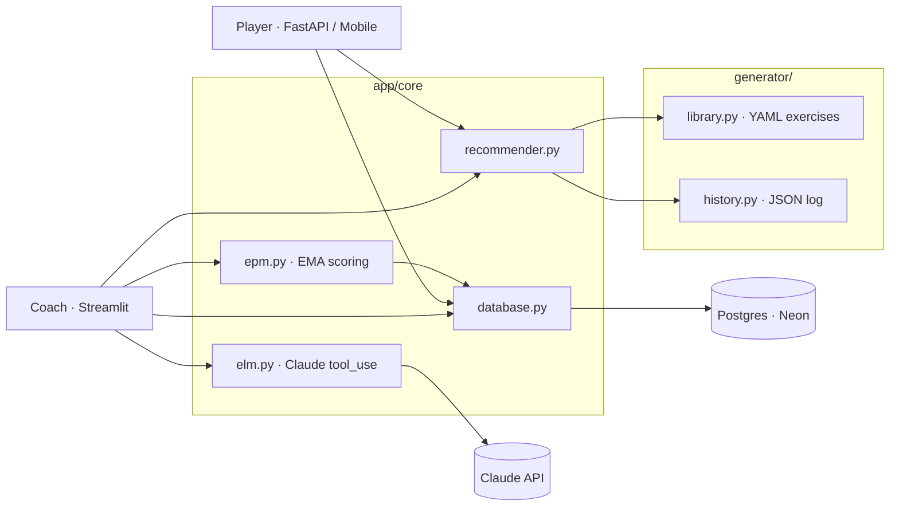

# KP13 Akademi

AI-augmented football coaching platform for individual player development. Combines an EPM (Entity Propensity Model) scoring system, an exercise library with recency-aware selection, and Claude-powered extraction of observations from coach notes. Currently supports two players (Sofus, Felix) through a Streamlit coach console and a mobile-friendly FastAPI player app.

For the full methodology, philosophy, and roadmap, see [VISION.md](VISION.md).

## Quick start

```bash
git clone <repo-url> && cd Kp13Akademi
make dev
make seed && make run-coach
```

Requires Python 3.12+ and a `DATABASE_URL` in `.env` pointing to a Postgres instance (Neon works well for dev branches).

## Repository tour

- [app/](app/) — Streamlit coach console + FastAPI player app + `core/` (EPM, recommender, database, Claude integration).
- [generator/](generator/) — Exercise library (YAML), session templates, history log, and CLI session generator.
- [clients/](clients/) — Per-player markdown profiles, goals, and curriculum notes.
- [team/](team/) — Team session documentation and recording guides.
- [home-training/](home-training/) — Home session templates (solo training).
- [skills/](skills/) — Agent skill scaffolding (EPM extraction, weekly progression, parent comms, etc.).

## Running the apps

**Coach console** (Streamlit):

```bash
make run-coach   # streamlit run app/Home.py
```

**Player app** (FastAPI, served over mobile-friendly HTML):

```bash
make run-player  # uvicorn on :8000, module app.web.main:app
```

## Generating a session

```bash
make generate-session   # python generator/generate.py
```

Interactive CLI that builds a session plan from the YAML exercise library and updates `generator/history/log.json`.

## Running tests

```bash
make test       # pytest
make lint       # ruff + mypy
```

Test coverage today: `app/core/epm.py`, `app/core/recommender.py`, `generator/library.py`, `generator/history.py`. Database and integration tests are deferred — see [plans](../.claude/plans/) and follow-up issues.

## Architecture



## Contributing

- File issues on GitHub with a clear repro or acceptance criteria.
- Before opening a PR: `make test` and `ruff check .` should pass.
- Commit messages: imperative mood, ≤72 chars for the subject.
- Schema changes: edit `_SCHEMA_STATEMENTS` in [app/core/database.py](app/core/database.py) and re-run against a dev branch — there is no migration tool yet.
